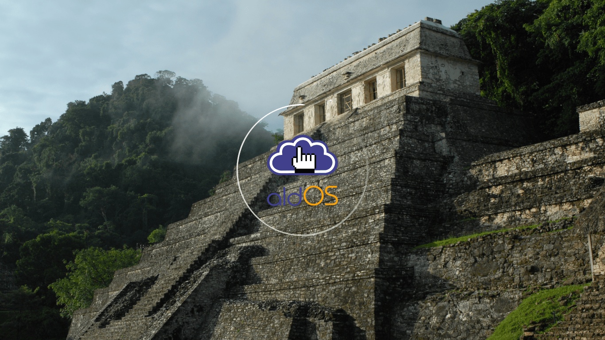

# Plymouth Piramide Theme.
Plymouth theme with a photo of a Palanque Piramid. It includes the logo of ALDOS Linux.

Photo the main piramid of Palenque, Mexico, by Peter Vandecaveye, available is under Public Domain and was taken from

https://pixabay.com/es/mexico-ruina-maya-cultura-853048/

## Installation.

This theme requires plymouth-plugin-script. Please install it first with **pkcon** (works in any distro) yum (CentOS7/RHEL7), dnf (Fedora) or apt-get (Debian, Devuan, Ubuntu, Linuxmint, etc.).

```
pkcon install plymouth-plugin-script
```

Next download and install theme.

```

git clone https://github.com/darkshram/piramide/

sudo cp -a piramide /usr/share/plymouth/themes/

sudo plymouth-set-default-theme piramide

sudo dracut -f

reboot
```
## How does it look like?


